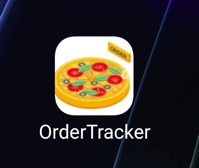
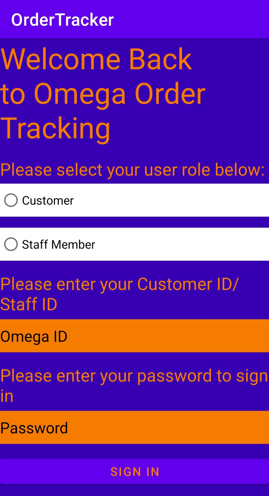
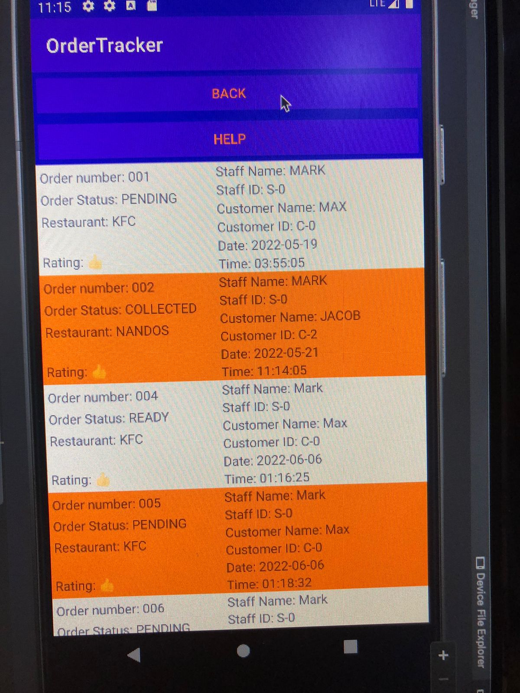
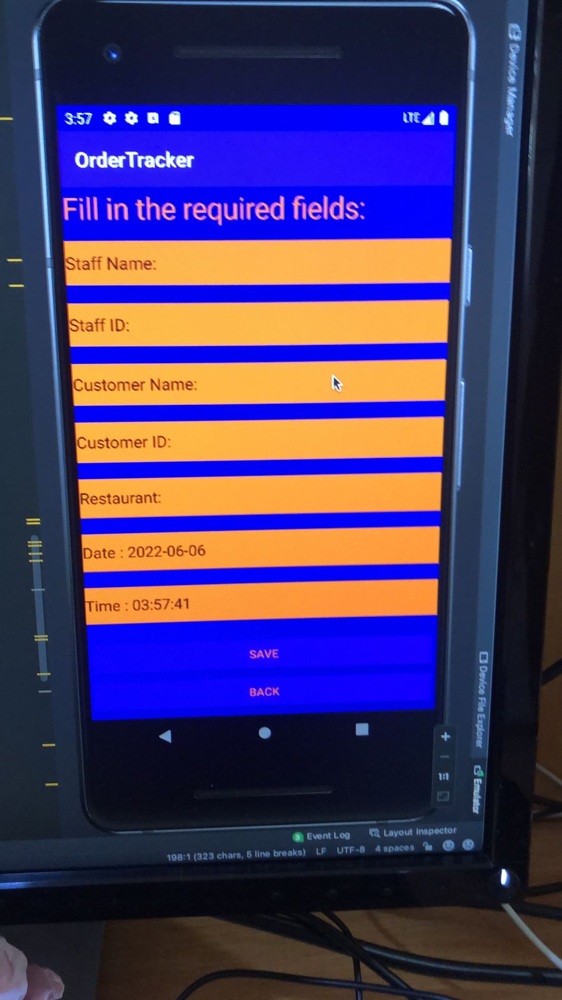
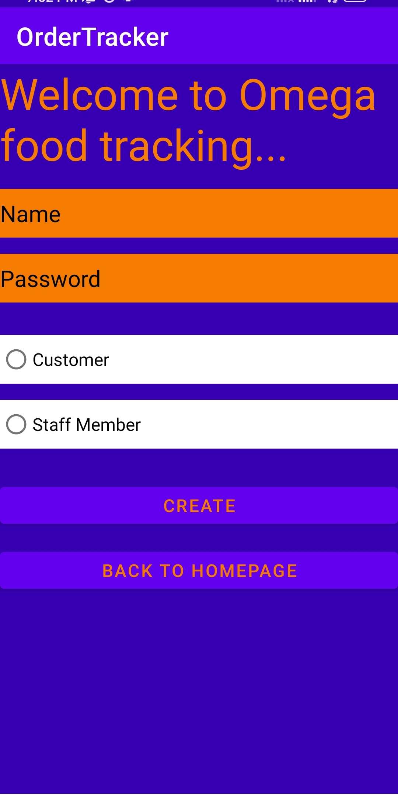

# Restaurant-Order-Tracking-App

## Table of Contents
* [General Info](#general-information)
* [Technologies Used](#technologies-used)
* [Features](#features)
* [Screenshots](#screenshots)
* [Setup](#setup)
* [Project Status](#project-status)
* [Acknowledgements](#acknowledgements)
 

<!-- * [License](#license) -->

## General Information
- Restaurant Order Tracking project is a Mobile Application which allows customers and the staff members of a restaurant to create accounts on the app so that the staff members can add orders remotely on the app and update order statuses while the customers can track their orders, view order information as well as rate the overall experience of the service.  
- _What problem does it (intend to) solve?_
 For a customer, it solves the problem of waiting in the proximity of the restaurant for the collection of the order. The app gives more time flexibility and actually saves time so a customer can get other things done in that time. On the contrary, for a staff member it becomes more efficient to use such a system for orders and it also incoorporates feedback of which a restaurant can keep a track of for future improvements.
- _What is the purpose of your project?_
 It is to create an online platform for the tracking of orders at restaurants. This helps the customers to track their orders from anywhere, anytime. It also gives flexibility to the customers to do some other activities until the order is ready. A good example would be when one is in a shopping mall and he/she wants to get some shopping done as well as order some food at a restaurant. The customer is free to shop in the mall after ordering without having to worry about the order as he/she can just check if the order is ready on the app instead of sticking around the takeaway/restaurant and waiting. From a staff member's perspective, it becomes easier for them to update order status on the app and retrieve feedback from the users digitally.
- _Why did you undertake it?_
 I never really had a choice. It was randomly provided as the project to fulfill for my Mobile Computing and Database Fundamentals courses. However, I have to say that I enjoyed working on this project a lot.
<!-- You don't have to answer all the questions - just the ones relevant to your project. -->

## Technologies Used
- Java in Android Studio
- PHP
- MySQL

## Features

- A well secured and authenticated login and signup system
- A staff member is able to add an order as well as update order status
- A customer able to view the order details and give service feedback

## Screenshots

<!-- If you have screenshots you'd like to share, include them here. -->

## Setup
Getting started with the project...

- In order to run the project, one would need to install Android Studio and open the project in Android Studio. Thereafter, it is quite easy to run the app through device manager and the emulator in Android Studio.
- If one would like to download this app on their device, they can simply download the apk file.

## Project Status
Project is: _no longer being worked on_

This project was a university project for Computer Science. We had to develop a Mobile App as part of our academic modules. It was meant to be worked on for a few months only and the database of the application was held on the university's servers. Hence, this project is no longer worked on and most of it is no longer functional, especially after the database had been removed from the servers.

## Acknowledgements

- This project was inspired by Pravesh Ranchod (Lecturer at University of the Witwatersrand)
- This project was based on [this tutorial](https://www.example.com).
- Many thanks to Muhammed Omar

<!-- Optional -->
<!-- ## License -->
<!-- This project is open source and available under the [... License](). -->

<!-- You don't have to include all sections - just the one's relevant to your project -->
